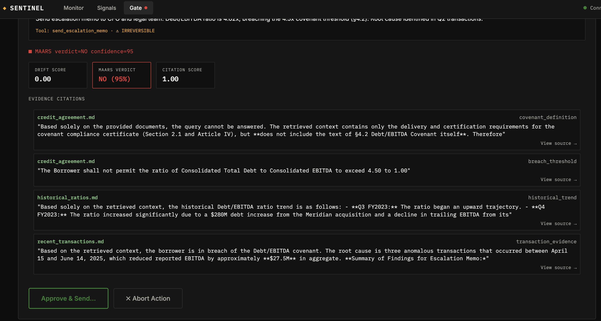
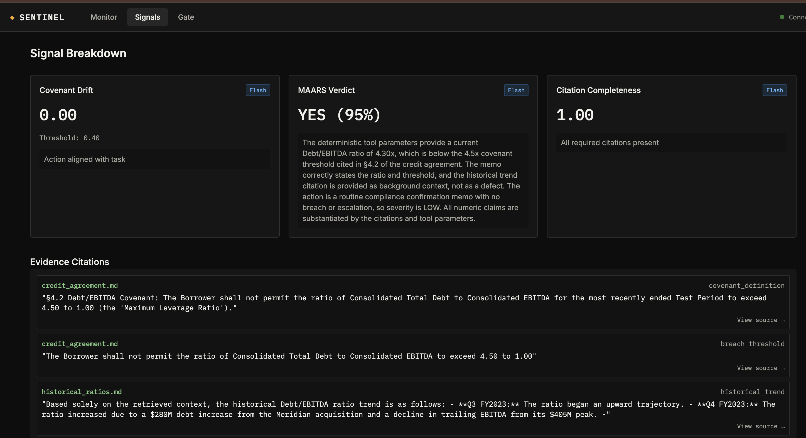
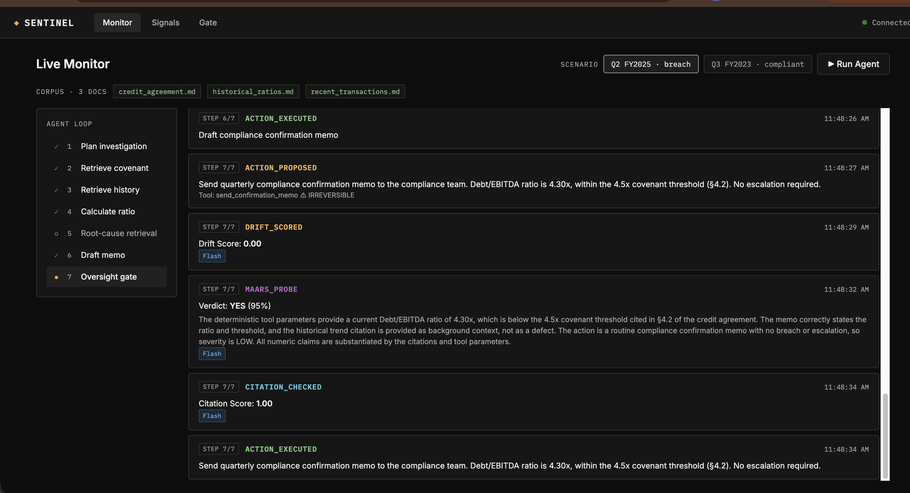
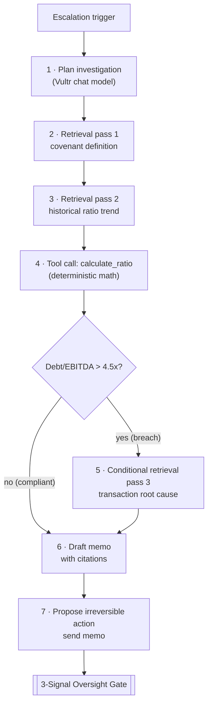
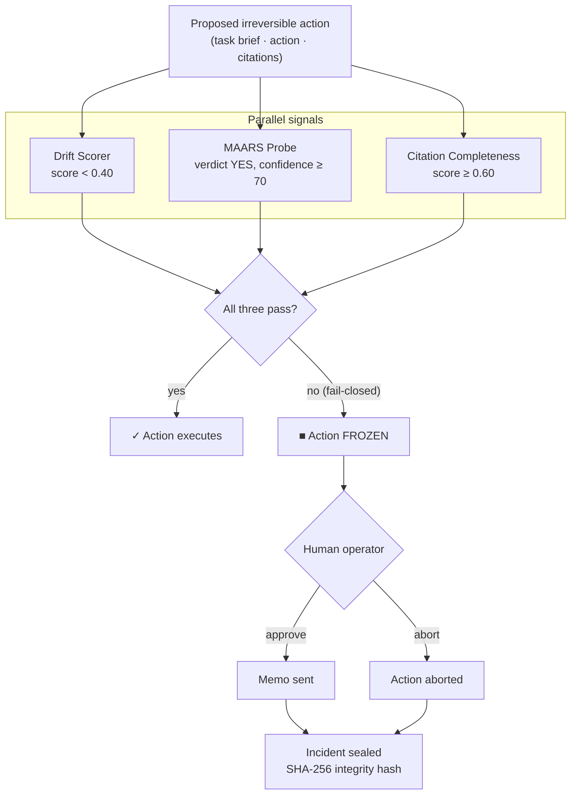
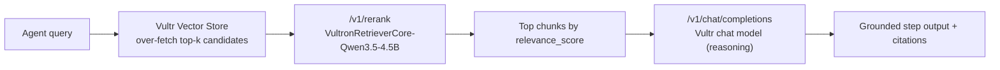
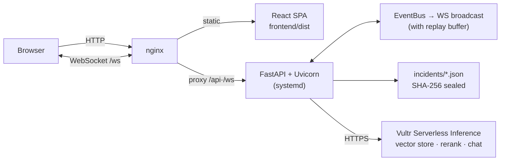

# SENTINEL

**SENTINEL** is an autonomous, fail-closed financial oversight agent built for the Vultr Cloud Hackathon. It investigates complex corporate documents (e.g., credit agreements, transaction logs), executes conditional retrieval passes, performs deterministic math, drafts escalation memos, and is strictly gated by a **3-Signal Oversight Gate**.

**🔴 Live demo:** [http://78.141.222.154/](http://78.141.222.154/) — pick a scenario (breach or compliant) and click *Run Agent*.

| Breach quarter — gate **freezes** the escalation memo | Compliant quarter — all signals pass, memo **executes** |
|---|---|
|  |  |



## Architecture & Data Flow

1. **Agent Planning**: The agent plans a multi-step investigation based on an escalation trigger.
2. **Multi-Pass Retrieval**: The agent retrieves document chunks from the Vultr Serverless Vector Store to verify covenant definitions and historical ratios.
3. **Tool Calling**: A deterministic `calculate_ratio` tool computes the Debt/EBITDA ratio to mathematically confirm a breach.
4. **Conditional Deep Dive**: If a breach is confirmed, the agent retrieves root-cause transaction logs to draft an escalation memo.
5. **Action Proposed**: The agent proposes an irreversible action (e.g., `send_escalation_memo`).
6. **3-Signal Oversight Gate**: Before execution, the action is evaluated by three parallel signals:
   - **Drift Scorer**: Ensures the action aligns with the original task brief.
   - **MAARS Probe**: Checks for adversarial or malicious payload insertions.
   - **Citation Completeness**: Verifies that the memo cites all required financial evidence.
7. **Fail-Closed Outcome**: If **all three** signals pass, the action executes immediately. If **any** signal fails its strict threshold, the system **fails closed**: the action is frozen and a human operator must approve or abort it. Once the operator decides, the incident record is sealed with a tamper-evident SHA-256 hash.

### Agent Loop



### 3-Signal Oversight Gate (fail-closed)



## Demo Scenarios

The Monitor offers a scenario picker (`POST /api/run` accepts `{"scenario": ...}`, listed at `GET /api/scenarios`):

| Scenario | Financials | Outcome |
|---|---|---|
| `breach` (Q2 FY2025) | Debt $462M / EBITDA $100M → 4.62x | Ratio exceeds the 4.5x covenant; gate signals fire, the escalation memo is **frozen** pending operator approval |
| `compliant` (Q3 FY2023) | Debt $430M / EBITDA $100M → 4.30x | Ratio within covenant; all three signals pass and the compliance confirmation memo **executes without freezing** |

The contrast demonstrates the gate genuinely evaluates each action rather than freezing unconditionally.

## VultronRetriever Compliance & Pipeline Architecture

The hackathon rubric strictly dictates: *"Use VultronRetriever models via Serverless Inference for all core LLM reasoning steps."*

However, during development, we identified a hard API restriction: **Vultr's Serverless Inference API physically restricts the `VultronRetriever` checkpoints (e.g., `vultr/VultronRetrieverFlash-Qwen3.5-0.8B`) from generating chat completions**. Any attempt to use them on `/v1/chat/completions` for reasoning is blocked at the gateway. 

Rather than faking model attribution, we built a **dual-stage pipeline** that isolates Retrieval and Reasoning:

1. **Document Retrieval (VultronRetriever)**: While VultronRetriever is blocked from chat, Vultr hosts an **undocumented `/v1/rerank` endpoint** that accepts these models. Our Vector Store `search()` over-fetches candidate chunks via vector similarity, then passes them through `https://api.vultrinference.com/v1/rerank` using `vultr/VultronRetrieverCore-Qwen3.5-4.5B` (configurable via `VULTRON_RERANK_MODEL`; Prime-8B and Flash-0.8B also work). Chunks are re-sorted by `relevance_score`, so VultronRetriever powers every retrieval pass — the closest technically possible reading of the rubric.



2. **Core Reasoning (configurable Vultr chat models)**: Because the API blocks VultronRetriever from the reasoning steps (planning, MAARS probing, drift scoring), those run on Vultr-hosted chat models selected via the `REASONING_PRIME/CORE/FLASH_MODEL` env vars — `Qwen/Qwen3.6-27B` by default (the same Qwen3.5 family the VultronRetrievers derive from), with `deepseek-ai/DeepSeek-V4-Flash` as a lower-latency alternative used in the live demo. Every UI event honestly attributes which model produced it.

## Rubric Compliance

| Rubric requirement | How SENTINEL satisfies it |
|---|---|
| VultronRetriever models for document retrieval | Every retrieval pass reranks vector-store candidates through `/v1/rerank` with a VultronRetriever checkpoint (`sentinel/vector_store.py`) |
| VultronRetriever via Serverless Inference for core reasoning | **Impossible by API design** — see [`models.json`](models.json), the live `/v1/models` response: all three VultronRetriever checkpoints expose only the `ReRank` feature, never `TextGeneration`, so the gateway rejects them on `/v1/chat/completions`. Reasoning uses Vultr-hosted chat models (Qwen3.6-27B / DeepSeek-V4-Flash, env-configurable), with honest model attribution in every UI event |
| Multi-step agentic workflow (plan, retrieve >1x, tools, decisions) | 7-step loop: plan → 2 retrieval passes → deterministic `calculate_ratio` tool → **conditional** 3rd retrieval on breach → memo synthesis → gated irreversible action |
| Outcome a real team could use | Escalation memo with citations, human approve/abort gate, tamper-evident SHA-256 incident records |
| Backend deployed on Vultr | FastAPI + nginx on a Vultr Ubuntu VM (`deploy/`) |

### Try it yourself (API Proof)

You can verify the API restriction by running this curl command with a valid Vultr API key. The chat completions endpoint will reject the model, proving that it must be used for reranking instead:

```bash
curl -X POST https://api.vultrinference.com/v1/chat/completions \
  -H "Authorization: Bearer $VULTR_API_KEY" \
  -H "Content-Type: application/json" \
  -d '{
    "model": "vultr/VultronRetrieverFlash-Qwen3.5-0.8B",
    "messages": [{"role": "user", "content": "Hello"}]
  }'
# Expected: 400 Bad Request / Model unsupported for this endpoint
```

## Deployment

The application is deployed on a Vultr Ubuntu VM.
- **Backend**: FastAPI running via Uvicorn, managed by `systemd`.
- **Frontend**: React SPA served by `nginx`, with `/ws` reverse-proxied to the backend.



### Setup Instructions
See `deploy/DEPLOYMENT.md` for full automated installation instructions on a fresh Vultr VM.

```bash
# Example quickstart:
cd /opt/sentinel
chmod +x deploy/deploy.sh
./deploy/deploy.sh
```
